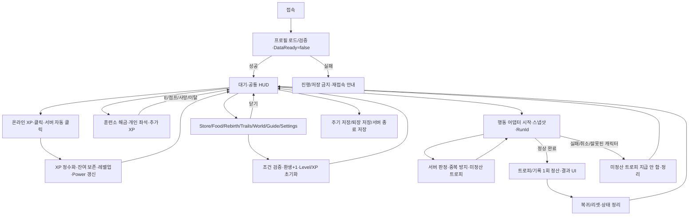

# 공통 게임 라이프 사이클

아래는 실제 구현의 의미를 행동 중립적으로 정리한 계약이다. 현 구현의 `TrainingLevel`은 일반 Level이고 `FlightState`는 행동 상태의 호환 키다. 범용 상태명을 구현할 때도 UI/경제 전체에 동일한 브리지를 적용한다.

## 1. 접속과 초기화

서버는 중복 없는 Remotes를 준비하고 `PlayerData.Start`가 프로필을 단독 소유한다. 로드 동안 DataReady=false,경제 변경은 거절한다. 값은 유한한 정수/최솟값/2^53−1/목록 범위를 검증한다. 로드 실패 시 기본값을 저장해 덮어쓰지 않는다. 성공 시 `leaderstats`,비공개 `ProgressStats`,장비 시각 속성을 게시하고 DataReady=true로 전환한다. UI는 필수 데이터/Remotes를 기다린다.

새 플레이어 Level=0,XP=0,Rebirths=0,Trophies=0,TrainingTier=1,기본 장비와 기본 트레일 소유. Power의 원시 기본값=1. 기본 온라인 XP는 서버 시계 기준1/s이며 캐릭터 존재·비행·훈련 여부와 독립적이다.

## 2. XP와 레벨업

수동 클릭은 UI에 소비되지 않은 MouseButton1 또는 TouchTapInWorld 1회다. 텍스트 입력 중/모달 중/카메라 드래그/조이스틱 홀드는 수동 XP 요청을 보내지 않는다. 서버는 살아 있는 현재 캐릭터/준비된 프로필/토큰 버킷을 검증한다. 기본 클릭1 XP,허용속도10/s,버스트2.

Free/OP/Off는 서로 배타적이다. UI 버튼을 다시 누르면 Off. 클라이언트는 모드만 보내고 서버 Heartbeat가 Free3/s,OP6/s를 계산한다. OP는 현 중간본에서는 무료 프리뷰다. dt의 XP 따라잡기는 .25s로 제한한다. 수동·자동 클릭은 행동 중에도 서버 조건을 충족하면 가능하다. UI 숨김과 서버 모드 Off를 혼동하지 않는다.

각 XP 입력은 환생×패드×XP 장비 배율을 적용하고 소수 잔여를 보존한 뒤 정수 XP로 지급한다. 여러 레벨을 한 번에 넘을 때 남는 XP를 보존한다. `ExperienceGained(gain,currentCharacter,source)`는 실제 커밋된 정수 지급량만 전송한다. UI 팝업은 .12s 안의 동시 지급을 합치고 .95s 후 제거하며 잘못된 캐릭터/오래된 팝업을 표시하지 않는다. 기본/훈련/클릭/행동 XP는 서로 추가되는 지급원이다.

레벨업 후 화면 Level·XP 게이지·Power·환생 조건을 데이터 변경 신호로 갱신한다. 레벨 캡은 없으며 수치 안전 한계는2^53−1. 정확한 곡선은 ECONOMY 및 동결 `ProgressionConfig.Advance/XPBetween`을 사용한다.

## 3. 훈련소와 영구 해금

7개 훈련소는 Wood→Stone→Iron→Gold→Diamond→Emerald→Divine. 기본 온라인 XP에 더해 각 훈련소의 추가 XP를 지급한다. 해금은 환생0~6만 요구한다. 예전 설정의 Level/Cost 필드를 현 모드에서 해금 조건/트로피 가격으로 재사용하지 않는다. 영구 최고 TrainingTier를 저장하며 낮은 시설을 써도 최고 해금값을 내리지 않는다.

서버는 .2s마다 접근을 검사한다. 이미 해금된 시설은 수평6stud/높이−2~8의 접근 범위에서 자동 착석한다. 잠긴 시설은 E/게임패드X/터치 프롬프트로 서버 해금을 요청한다. 시설 근접/살아 있음/비고정 캐릭터/Idle/DataReady가 필요하다. 한 보이는 시설에 여러 플레이어가 앉아도 각자의 숨긴 물리 Seat/세션/XP 시계를 사용한다. 서로 충돌하지 않고 같은 시설의 다른 착석 캐릭터는 로컬에서 가린다.

E/점프는 자기 세션만 해제한다. 나온 시설은 수평9stud 바깥으로 나갔다가 들어오기 전까지 자동 재착석 금지. 수직 점프만으로 이 블록을 풀지 않는다. 사망/캐릭터 제거/행동 전환/좌석 거리·점유 불일치/퇴장은 좌석·충돌 그룹·연결을 정리한다. 서버1s 루프의 실경과시간을 최대2s로 제한하며 반복 호출로 훈련 XP를 늘리지 못한다.

## 4. 행동·적중·보상·복귀

공통 코어는 1플레이어=1활성 RunId,현재 캐릭터 참조,시작 시 Power/장비 스냅샷,서버 검증된 적중,중복 방지,한 번의 결과 정산을 유지한다. 로켓 어댑터의 실상태는 Idle→Flying→Result→Returning→Idle. Dive는 Flying 내부의 상태이며 경제 상태를 새로 열지 않는다. 대포 전용 Aim 상태/금화 구매는 현 공통 사이클이 아니다.

행동 시작은 준비된 프로필,살아 있는 현재 캐릭터,Idle/쿨다운/행동 전용 시작 위치를 서버가 검사한다. 시작 후 모달을 닫고 대기용 메뉴를 숨긴다. 원시 Power와 행동 파라미터는 서버가 계산한다. 캐릭터의 레벨이 행동 중 올라가더라도 현재 로켓의 시작 Power는 다시 계산하지 않는다. 부스트 Wins는 각 적중 시점의 유효 배율로 보상을 평가한다.

트로피는 논리적 목표1개 단위다. 파편/연출 조각/XP 링이 추가 트로피 적중을 만들지 않는다. TargetId/RunId/Character와 서버의 기하학 판정으로 중복을 차단한다. 현재 로켓에서는 `run.trophies`에 미정산 보상을 누적하고 성공 완료 때 `Data.Award`로 딱 한 번 잔액·기록을 커밋한다. 클라이언트가 표시한 점수/고도는 신뢰하지 않는다. 기존 잔액은 실패로 차감하지 않는다. 즉시 지급된 온라인/클릭/행동 XP는 실패 시 되돌리지 않는다.

결과는 공통 Result 생명주기를 유지하고 자동 복귀 후 머리 위 텍스트 묶음으로 지급XP/트로피/Peak·BreakScore/추가링·기록을 표시한다. 현 화면에는 중앙 ResultPanel/Return 버튼이 없다. 서버metrics는고도/시간/적중 등도 포함하지만 모든필드가화면에표시되는것은아니다. 측정 이름/단위/행동 전용 기록 문구만 행동 어댑터가 제공한다. 현재 ReturnDelay=.2s/캐릭터 리로드는 로켓 방식이다. 돌/침/검은 자기 행동 대상/애니메이션을 정리하고 공통 Idle을 복구해도 된다. 기존 머리위결과연출·모달/훈련/입력 잠금/자동 클릭 상태와 결과 정산은 동일해야 한다.

사망/잘못된 RunId/캐릭터 교체/데이터 사용 불가/퇴장 시 현재 Run만 정리한다. 정상 완료 여부를 어댑터가 임의의 클라이언트 메시지로 결정하지 않는다. 로켓의 구름 압력·고도 판정·강하 접촉은 ACTION_ADAPTER의 행동 전용 구현이다.

## 5. 환생

요구 Level=`20*(Rebirths+1)`. 레벨업을 계속할 수 있고 자동 환생은 하지 않는다. Rebirth 페이지 Confirm을 누르면 현재 환생 횟수를 expected로 보내고 서버가 준비/Idle/정수/현재 값 일치/요구 Level/최대1000000을 검사한다. 요청이 오래되어 현재 값과 다르면 거절한다.

성공: Rebirths+1,TrainingLevel=0,TrainingXP=0,소수 XP 잔여=0. 훈련/기본 XP의 경과시간 기준을 재설정한다. 기본 무료 장비 마일스톤도 갱신한다. **Trophies,TrainingTier,XP 장비,장비/트레일 소유·선택,기록은 유지한다.** 세션 부스트/음식/자동 클릭도 환생 코드가 직접 초기화하지 않는다. 실패: 값 변경 없음,상태 안내. Skip Rebirth는 Coming Soon만 표시한다.

## 6. 부스트·음식·친구·시간 이벤트

음식 선택은 세션1개,공짜,중복 배율 합산 없음. 기간 Power 부스트는2/4/8 중 하나로 교체되고 다시 쓰면900s로 재설정된다. Wins2는 별도900s. 서버 시간 기준 만료 시1배. 같은 서버에 실제 존재하는 검증된 친구1명당10%,퇴장 즉시 제거. 서로 다른 요인은 곱하며 Food+Friend를 한 항으로 합치지 않는다.

공통 보너스 이벤트는 서버 공유1800s 주기/180s 활성/플레이어당한 웨이브최대3개의 서로 다른 목표/중복 지급 금지. 보상은 현재 레벨 기준 최소200 또는4레벨의 누적 XP 중 큰 값,추가 배율 없는 지급. 현 어댑터의 GoldRing 교차 판정·링 위치는 로켓 전용이다. 다른 행동에서는 같은 이벤트 슬롯/타이머/횟수/XP를 유지하고 적중 목표 표현·서버 판정만 교체한다.

## 7. 저장·퇴장·재접속

미게시 Studio는 StudioMemory로만 실행하고 읽기/쓰기 API를 호출하지 않는다. 게시 게임은 Persistent이며 저장 실패 시 메모리 기본값으로 바꾸지 않는다.60s 자동 저장,퇴장 저장,서버 종료 최대25s 대기. UpdateAsync는 당시 로드/마지막 저장 스냅샷과 이전 값을 비교하여 다른 세션의 변경을 덮어쓰지 않는다. 충돌이면 DataReady=false/재접속 처리. 음식·기간 부스트·친구·음소거·자동 클릭 선택·훈련 좌석·활성 Run은 저장하지 않는다.

새 게임은 별도 DataStore 이름을 사용하되 데이터 모델/검증/동시성/마이그레이션 의미를 유지한다. 구 게임의 금화→트로피 변환 같은 과거 호환 로직은 새 게임 신규 데이터에 임의로 반복 적용하지 않는다.
